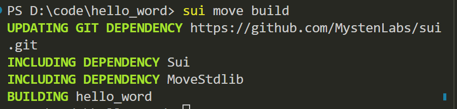
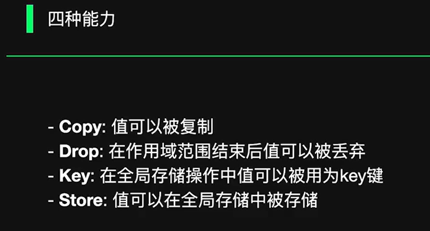

- 编译成功







```

查看地址
sui client addresses
切换地址
sui client switch --address <addr>

导入地址，用助记词
sui keytool import "<助记词>" ed25519


列出当前所有网络别名: sui client envs

添加新的网络别名: sui client new-env --alias <ALIAS> --rpc <RPC>

切换网络: sui client switch --env [network alias]


查询当前保存了密钥的地址: sui client addresses
查询当前启用的地址: sui client active-address
列出所拥有的 gas objects: sui client gas
```